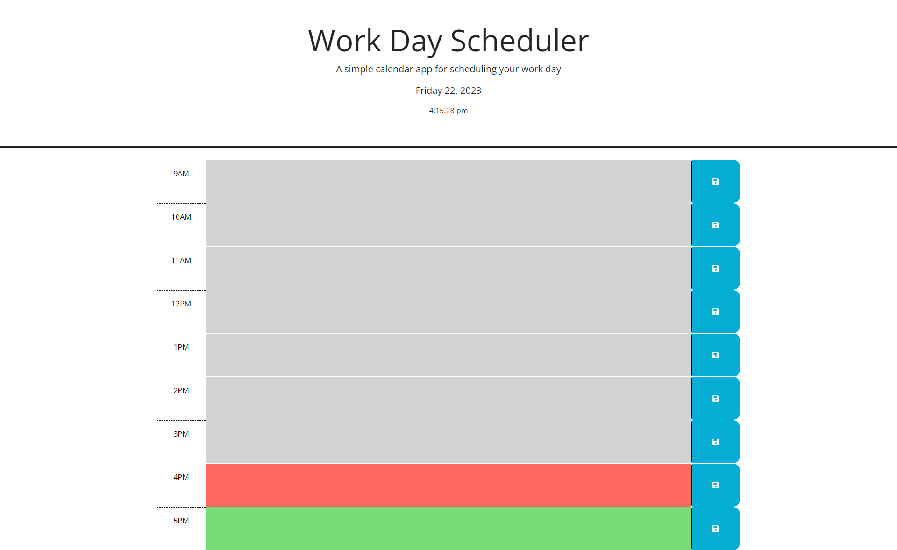

# Day Planner

## Description

An incomplete daily scheduler was presented to us by the client.  The application in its current state when initially offered did not have the functionality required.  The following feature updates were requested:

    1. The current day displays at the top of the page.
    2. Time blocks with standard business hours of 9am - 5pm.
    3. Color coded time blocks showing past, current, and present time based on the hour.
    4. The ability to enter text and schedule related information into the time block.
    5. Using the save button would store the information entered.
    6. Information previously entered would persist when the page is refreshed.

## Website URL

https://chilejay7.github.io/Day-Planner/

## Usage

A screenshot of the application has been included below for reference.  The current date and time will be displayed at the top of the page when it loads.  The time will continue to dynamically update its value after the page loads.  All time blocks will be colored based on the time of day.  Blocks in the past will be colored gray, while the current hour will appear in red.  Future time blocks will be green.  Text can be entered into each time block.  After entering the necessary information, clicking the save button will store the information.  Any information previously entered into the application and saved will load when the page is refreshed.

## Credits

N/A

## License

Please refer to the LICENSE in the repo for further information.